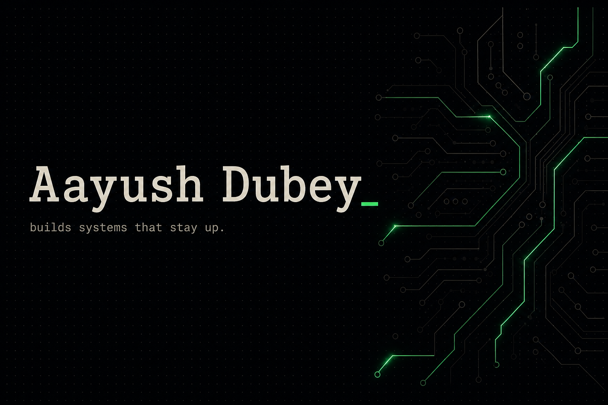

<div align="center">
  
</div>

<br />

<div align="center">

  `● SYSTEM ONLINE` &nbsp;·&nbsp; `svc: aayush-dubey.backend` &nbsp;·&nbsp; `net: NSUT · Delhi`

  

  <br />

  [](https://aayush-portfolio-sandy.vercel.app/)
  [](https://www.linkedin.com/in/aayush-kumar-dubey-917bb9285)
  <a href="mailto:aayushdubey.work@gmail.com"></a>
  [](https://aayush-portfolio-sandy.vercel.app/)

</div>

---

Backend engineer working where **reliability is the feature** — FastAPI platforms, multi-tenant auth, OCR/RAG pipelines, and observable LLM workflows. I care about the unglamorous parts: tenancy boundaries, schema design, and traces that make 2 a.m. debugging survivable.

Currently shipping production backends at **Flywheel** — a multi-tenant document ingestion platform (OCR, translate, review, index) with Keycloak auth, Marqo search, and self-hosted models on H100s.

```
role      Software Engineering Intern · Flywheel
study     B.Tech ICE · NSUT Delhi · 2023–present
focus     APIs · multi-tenancy · OCR / RAG · eval pipelines
looking   SDE / internship · 2026 · backend, platform, full-stack
```

## now

- Shipping **20+ merged PRs** into a production multi-tenant document platform (FastAPI, Temporal, MinIO, Marqo, React)
- Owning **Keycloak JWT + RBAC** so mutating endpoints stay tenant-scoped — fail-closed, not decorative
- Designing **document lifecycle APIs** (include / soft-delete / restore / chunk delete) so vector index and relational store never drift
- Replacing cloud OCR/translation with **self-hosted Chandra + Gemma on vLLM (H100)** — OCR accuracy **77% → 90%**

## `> shipped_work`

<table>
  <tr>
    <td width="33%" valign="top">
      <h3>📄 KAI</h3>
      <p>A full-stack RAG desk that answers from retrieved PDF evidence — hybrid retrieval, Gemini reranking, and page-level citations.</p>
      <p><code>Next.js</code> <code>Qdrant</code> <code>Gemini</code> <code>RAG</code></p>
      <a href="https://github.com/nexus69420/kai-ai-rag"><b>source ↗</b></a> · <a href="https://kai-ai-rag.vercel.app"><b>live ↗</b></a>
    </td>
    <td width="33%" valign="top">
      <h3>🏠 Airbnb Clone</h3>
      <p>End-to-end booking platform with layered FastAPI services, JWT auth, and 9 domain entities across explore / book / host flows.</p>
      <p><code>Next.js</code> <code>FastAPI</code> <code>SQLAlchemy</code> <code>JWT</code></p>
      <a href="https://github.com/nexus69420/Airbnb-clone"><b>source ↗</b></a> · <a href="https://airbnb-clone-sand-five.vercel.app"><b>live ↗</b></a>
    </td>
    <td width="33%" valign="top">
      <h3>🔬 OCR Benchmark</h3>
      <p>A resumable benchmarking harness that scores OCR/VLM engines on accuracy-vs-latency — used to pick production models on H100s.</p>
      <p><code>Python</code> <code>vLLM</code> <code>OCR</code> <code>Eval</code></p>
      <a href="https://github.com/nexus69420/ocr-benchmark-v2"><b>source ↗</b></a>
    </td>
  </tr>
</table>

## `> proof_of_work`

<div align="center">

| `20+ PRs` | `77% → 90%` | `80K+ users` | `15K+ chunks` |
|:---:|:---:|:---:|:---:|
| merged into production | OCR accuracy after benchmarking | on systems & DBs managed | indexed for semantic search |

</div>

- Shipped **Keycloak JWT + RBAC** from scratch, gating all mutating endpoints behind scoped permissions with **15** auth/tenancy tests.
- Refactored the vector store behind a single **VectorStore** protocol — removed **11** direct Marqo call sites and **152** lines of duplicated logic.
- Built document lifecycle APIs (include / soft-delete / restore / chunk delete) with fail-closed ordering between the vector index and relational store.

## `> systems_i_reach_for`

<div align="center">
  
</div>

## telemetry

<div align="center">
  
  
</div>

<div align="center">
  
</div>

<div align="center">
  <picture>
    <source media="(prefers-color-scheme: dark)" srcset="https://raw.githubusercontent.com/nexus69420/nexus69420/output/github-contribution-grid-snake-dark.svg" />
    <source media="(prefers-color-scheme: light)" srcset="https://raw.githubusercontent.com/nexus69420/nexus69420/output/github-contribution-grid-snake.svg" />
    
  </picture>
</div>

## connect

Open to **2026** software-engineering internships and full-time roles — backend, platform, or full-stack. If you're hiring for systems that need to stay up, I'd like to hear about it.

<p align="center">
  <a href="https://aayush-portfolio-sandy.vercel.app/">portfolio</a>
  &nbsp;·&nbsp;
  <a href="mailto:aayushdubey.work@gmail.com">aayushdubey.work@gmail.com</a>
  &nbsp;·&nbsp;
  <a href="https://www.linkedin.com/in/aayush-kumar-dubey-917bb9285">linkedin/in/aayush-kumar-dubey</a>
</p>

<p align="center">
  <sub><code>uptime 100% · last deploy: now</code></sub>
</p>
